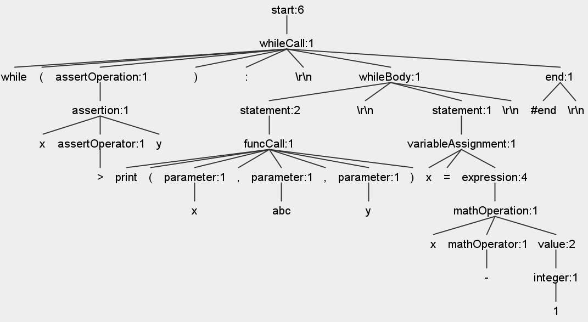
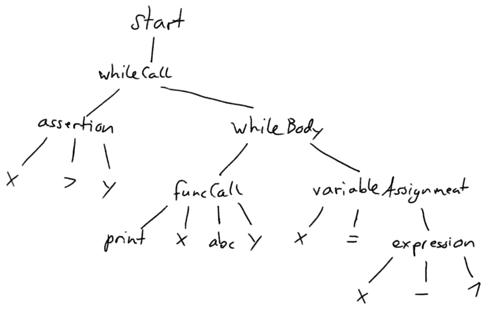

## Aufgabe 1.1
Die Datei `MiniPython.g4`.

Noch auftretende Probleme:
- Die als non-greedy gekennzeichneten Wildcards bei `comment` und `string` verhalten sich nicht non-greedy und matchen alles nach dem `"` bzw `#`. 
    - Fehler scheint behoben, wenn Parser Regeln in Lexer Regeln umgewandelt werden.

## Aufgabe 1.2
Code in den Ordnern `MiniPythonPython` und `MiniPythonJava` für Python bzw Java Code.

## Aufgabe 1.3
Für die Darstellung des Konzepts für die Übersetzung des Parse-Trees und einen AST wird folgendes Beispiel verwendet:
```
while(x>y):
    print(x, abc, y)
    x=x-1
#end
```
Der String wurde mit `abc` ersetzt aufgrund des Problems aus A1.1.



Davon können einige Token weggelassen werden, da diese für den weiteren weiteren Compiler nicht relevant sind.

Das könnte dann so aussehen:


Token wie `end`, `NEWLINE` oder die Klammern können weggelassen werden.